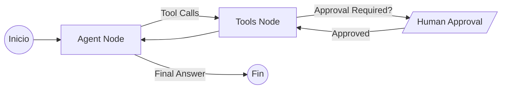

# 🤖 OrchestratorBot: Motor de Orquestación Autónomo

`OrchestratorBot` es el motor de orquestación de alto rendimiento de `sonika-ai-toolkit`. Está diseñado para ejecutar tareas complejas de manera autónoma utilizando un patrón **ReAct (Fast Edition)** sobre **LangGraph**, con soporte nativo para interrupciones humanas y memoria persistente.

Está optimizado para la **velocidad y la autonomía**, permitiendo que el modelo razone y actúe en un bucle fluido.

---

## 🌟 Características Principales

*   **Fast ReAct Loop**: Un ciclo de ejecución optimizado (`agent` <-> `tools`) que reduce la latencia entre pasos.
*   **Human-in-the-Loop (HITL)**: Control de riesgos integrado. Las herramientas con `risk_level > 0` pausan automáticamente la ejecución para solicitar aprobación humana.
*   **Memoria Persistente**: Gestión automática de archivos `MEMORY.md` (contexto histórico) y `SKILLS.md` (patrones aprendidos).
*   **Streaming Nativo**: Soporta `astream_events` para una integración fluida con interfaces de usuario, permitiendo ver el "pensamiento" (thinking) en tiempo real.
*   **Compatibilidad MCP**: Integración nativa con el *Model Context Protocol* para extender herramientas dinámicamente.

---

## 🏗️ Arquitectura y Nodos

El `OrchestratorBot` utiliza una arquitectura **Fast ReAct** compacta compilada como un grafo de estado de LangGraph. Todos los nodos están implementados **inline en `graph.py`** (no hay un directorio de nodos aparte). El cableado del grafo es fijo.

### Nodos del grafo

Dos nodos siempre presentes y dos opcionales:

1.  **🧠 `agent`**: El cerebro del flujo. Razona sobre el objetivo, lee la memoria histórica y decide si invoca herramientas o genera la respuesta final.
2.  **🛠️ `tools`**: El ejecutor. Procesa las llamadas a herramientas, maneja la lógica de **HITL (Human-In-The-Loop)** mediante interrupciones nativas de LangGraph y captura las observaciones para devolverlas al agente.
3.  **📋 `plan`** *(opt-in: `enable_planning=True`)*: Aplica las señales `set_plan` / `update_step` que el modelo emite y mantiene el snapshot del plan.
4.  **❓ `ask_user`** *(opt-in: `enable_user_questions=True`)*: Dispara la interrupción `question_request` para hacer preguntas estructuradas al usuario y espera la respuesta vía `set_resume_command()`.

Con ambas opciones desactivadas, la topología es exactamente el ciclo ReAct clásico de dos nodos (`agent ⇄ tools`).

---

## 🔄 Flujo de Ejecución

El orquestador opera como una máquina de estados simplificada:



1.  **Agent Node**: El modelo analiza el objetivo (`goal`), lee la memoria y decide si llamar a una herramienta o dar una respuesta final.
2.  **Tools Node**: 
    - Si la herramienta es de riesgo, genera un `interrupt` de LangGraph.
    - Ejecuta las herramientas y devuelve los resultados como `ToolMessage`.
3.  **Memory Management**: Al finalizar, el sistema puede actualizar los registros de memoria para optimizar futuras ejecuciones.

---

## 🛠️ Modos de Operación

El bot soporta tres modos principales definidos en el `OrchestratorState`:

*   **`ask` (Por defecto)**: Modo interactivo. Requiere aprobación para herramientas con riesgo.
*   **`auto`**: Modo totalmente autónomo (utilizado en scripts heredados o procesos batch).
*   **`plan`**: Solo genera un plan detallado en texto/markdown sin llegar a ejecutar herramientas.

---

## 🚀 Ejemplo de Uso

```python
from sonika_ai_toolkit.agents.orchestrator.graph import OrchestratorBot
from sonika_ai_toolkit.utilities.models import OpenAILanguageModel

# 1. Configurar modelos
model = OpenAILanguageModel(model_name="gpt-4o")

# 2. Inicializar el Orquestador
orchestrator = OrchestratorBot(
    strong_model=model,
    fast_model=model,
    instructions="Eres un experto en automatización de sistemas.",
    tools=[herramienta_de_archivo, herramienta_git],
    memory_path="./my_bot_memory"
)

# 3. Ejecutar flujo (Async)
async def main():
    response = await orchestrator.arun(
        goal="Analiza los logs de error y crea un issue en GitHub con el resumen."
    )
    print(response.content)

# O usar el API de eventos para streaming
async def stream():
    async for event in orchestrator.astream_events(goal="..."):
        print(event)
```

---

## 📂 Gestión de Memoria

El orquestador utiliza el `MemoryManager` para mantener dos archivos clave en `memory_path`:
- **`MEMORY.md`**: Un diario de sesiones pasadas. Ayuda al bot a recordar qué hizo en ejecuciones anteriores.
- **`SKILLS.md`**: Almacena patrones de éxito o configuraciones de herramientas aprendidas dinámicamente.

---

## 🛡️ Control de Riesgos

Cualquier herramienta registrada en el `ToolRegistry` puede definir un `risk_level`:
- **Nivel 0**: Ejecución automática.
- **Nivel 1+**: Dispara un `interrupt` solicitando confirmación del usuario antes de proceder.
