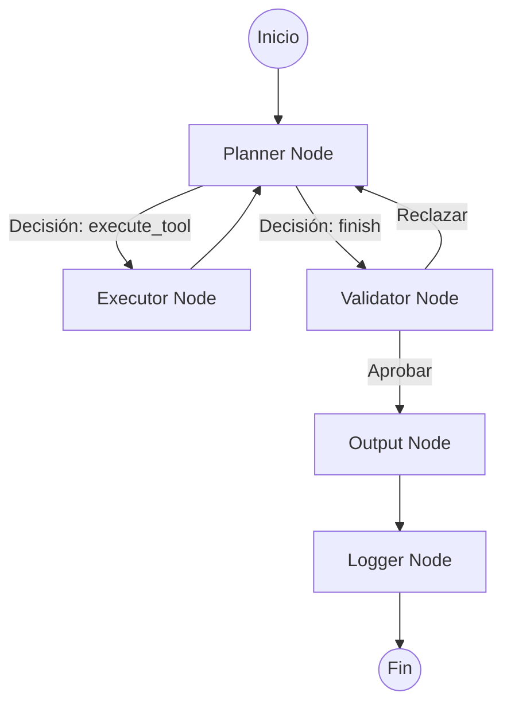

# 🤖 TaskerBot: Agente Orquestador

El `TaskerBot` es el motor de orquestación avanzado de la librería `sonika-ai-toolkit`. Está diseñado para manejar tareas complejas mediante un patrón **ReAct (Reasoning and Acting)** mejorado, utilizando una arquitectura de grafos de estado (**LangGraph**).

A diferencia de los agentes estándar, el `TaskerBot` separa las responsabilidades de planificación, ejecución y validación en nodos especializados, lo que permite una mayor robustez y trazabilidad en flujos multicanal (Email, CRM, etc.).

---

## 🏗️ Arquitectura y Nodos

El bot se basa en un flujo cíclico de 5 nodos principales:

1.  **🧠 Planner Node (`planner`)**: El cerebro del sistema. Analiza la petición del usuario y el historial para decidir si necesita ejecutar una herramienta o si ya tiene suficiente información para responder.
2.  **🛠️ Executor Node (`executor`)**: Las manos del sistema. Se encarga de la ejecución técnica de las herramientas (tools) seleccionadas por el Planner y devuelve los resultados (observaciones) al flujo.
3.  **⚖️ Validator Node (`validator`)**: El control de calidad. Revisa la respuesta generada o el plan ejecutado para asegurar que cumple con las limitaciones y el propósito definido. Puede rechazar un plan y devolverlo al Planner para corrección.
4.  **🗣️ Output Node (`output`)**: La voz del bot. Toma toda la información recopilada y genera la respuesta final respetando la personalidad y el tono configurado.
5.  **📝 Logger Node (`logger`)**: El registrador. Procesa y emite los logs acumulados durante todo el ciclo de vida de la ejecución.

---

## 🔄 Flujo de Ejecución

El flujo sigue una estructura de grafo dirigida:



1.  **Entrada**: Se recibe el input del usuario y el estado actual de la conversación.
2.  **Ciclo ReAct**: El Planner y el Executor interactúan en bucle hasta que el Planner decide que la tarea está lista.
3.  **Validación**: El Validator asegura que no se hayan violado restricciones.
4.  **Salida**: El Output genera el texto final y el Logger limpia el estado.

---

## 📊 Gestión de Estado (`ChatState`)

El bot utiliza un objeto `ChatState` que se propaga y muta a través de los nodos. Este estado incluye:
*   `messages`: Historial acumulativo de la conversación.
*   `logs`: Registro de eventos del sistema.
*   `tools_executed`: Lista detallada de herramientas llamadas y sus resultados.
*   `token_usage`: Seguimiento del consumo de tokens por nodo.
*   `planner_output`, `executor_output`, etc.: Resultados específicos de cada paso.

---

## 🚀 Cómo correr el flujo

Para instanciar y ejecutar el `TaskerBot`, se requiere un modelo de lenguaje que implemente la interfaz `ILanguageModel`.

### Ejemplo básico:

```python
from sonika_ai_toolkit.agents.tasker.tasker_bot import TaskerBot
from sonika_ai_toolkit.utilities.models import OpenAILanguageModel

# 1. Configurar el modelo
llm = OpenAILanguageModel(api_key="...", model_name="gpt-4-turbo")

# 2. Instanciar el Orquestador
bot = TaskerBot(
    language_model=llm,
    embeddings=None,
    function_purpose="Asistente bancario para gestión de cuentas.",
    personality_tone="Profesional y servicial.",
    limitations="No dar consejos de inversión.",
    dynamic_info="Hoy es 22 de Febrero de 2026.",
    tools=[mi_herramienta_de_email, mi_herramienta_crm]
)

# 3. Ejecutar
response = bot.get_response(
    user_input="Envía un correo a Juan con el resumen de su cuenta",
    messages=[],
    logs=[]
)

print(response.content)
print(response.tools_executed)
```

---

## 📂 Estructura de Archivos
*   `tasker_bot.py`: Clase principal y definición del grafo.
*   `state.py`: Definición del `TypedDict` para el estado.
*   `nodes/`: Implementación de la lógica de cada nodo.
*   `prompts/`: Archivos `.txt` con los system prompts de cada nodo para facilitar su edición sin tocar código.
